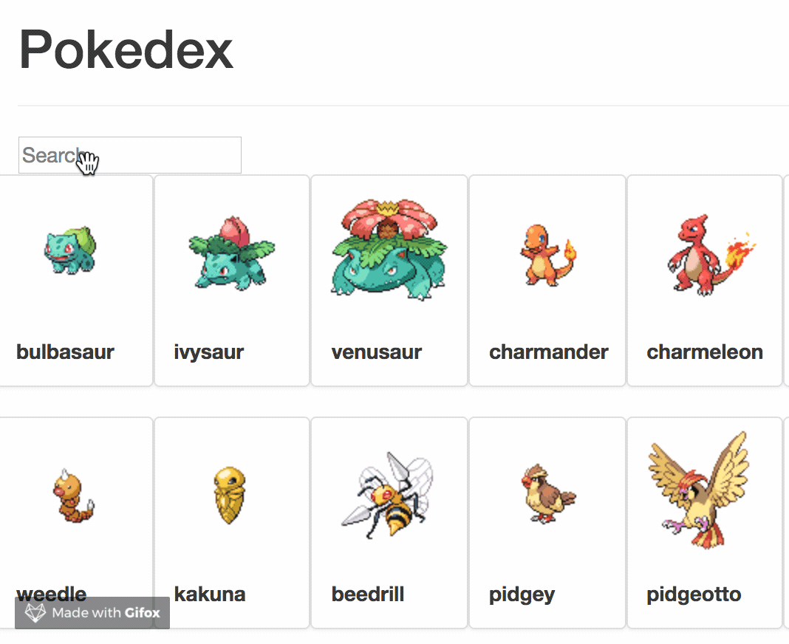

# Pokedex

Simple pokedex done with React

Using data from [PokéApi](http://pokeapi.co/)

## Usage

launch the app in dev mode : `npm start`

luanch the unit tests : `npm run test`

build the app : `npm build`
